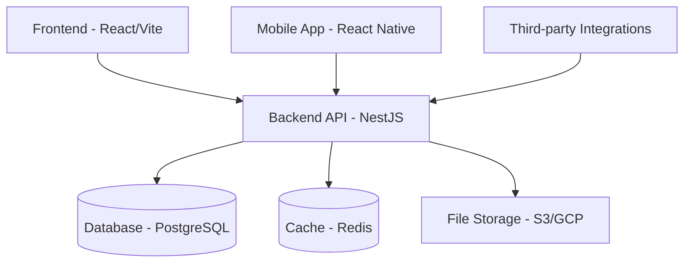

# Architecture Overview

## System Components

### Frontend
- **Framework**: React with Vite
- **State Management**: Zustand
- **UI Library**: TailwindCSS + ShadCN/UI
- **Charts**: Chart.js

### Backend
- **Framework**: NestJS (Node.js)
- **Database**: PostgreSQL with Prisma ORM
- **Caching**: Redis
- **Real-time**: WebSocket
- **Authentication**: JWT

### Infrastructure
- **Containerization**: Docker
- **Orchestration**: Kubernetes
- **Cloud**: AWS/GCP
- **CI/CD**: GitHub Actions

## High-Level Architecture Diagram

## Data Flow

1. User interacts with frontend application
2. Frontend makes API calls to backend
3. Backend processes requests and interacts with database
4. Data is cached in Redis for performance
5. Files are stored in cloud storage
6. Real-time updates are pushed via WebSocket